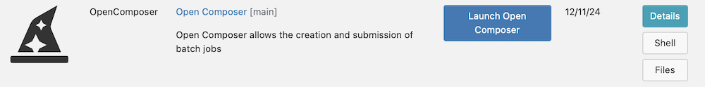

## Open Composerのインストール方法
Open Composerは[Open OnDemand](https://openondemand.org/)上で動作します。Open ComposerをOpen OnDemandのアプリケーションディレクトリ`/var/www/ood/apps/sys/`に保存してください。

```
# cd /var/www/ood/apps/sys/
# git clone https://github.com/RIKEN-RCCS/OpenComposer.git
# cd OpenComposer
# bundle config path --local vendor/bundle
# bundle install
```

## Open Composerの設定
`./OpenComposer/conf.yml.erb`を編集してください。`login_node`と`scheduler`以外は省略可能です。

| 項目名 | 設定内容 |
| ---- | ---- |
| login_node | 履歴ページからOpen OnDemandのWebターミナルを起動した際のログイン先 |
| dataroot | データの保存先 |
| scheduler | 利用するスケジューラ|
| bin_path | ジョブスケジューラのPATH |
| ssh_wrapper | SSHを用いて他のノードのジョブスケジューラを用いる場合のログイン先 |
| footer | フッタに記載する文字 |
| thumbnail_width | トップページの各アプリケーションのサムネイルの横幅 |
| navbar_color | ナビゲーションバーの色 |
| dropdown_color | ドロップダウンメニューの色 |
| footer_color | フッタの色 |
| category_color | トップページのカテゴリの背景色 |
| description_color | フォームページのアプリケーション説明の背景色 |
| form_color | フォームページのテキストエリアの背景色 |

## Open OnDemandへの登録（管理者）
Open Composerを`/var/www/ood/apps/sys/`に保存すると、Open OnDemandのトップページにOpen Composerのアイコンが表示されます。もしOpen Composerのアイコンが表示されない場合は、Open OnDemand用の設定ファイル`./OpenComposer/manifest.yml`を編集ください。

Open Composer上の各アプリケーションをOpen OnDemandのトップページに表示することもできます。例えば、`./OpenComposer/apps/Slurm/`というアプリケーションを表示させたい場合は、同名のディレクトリをOpen OnDemandのアプリケーションディレクトリに作成します（`# mkdir /var/www/ood/apps/sys/Slurm`）。そして、そのディレクトリ内にOpen OnDemand用の設定ファイル`manifest.yml`を作成します。

```
# cat /var/www/ood/apps/sys/Slurm/manifest.yml
---
name: Slurm
category: Jobs
url: https://example.net/pun/sys/OpenComposer/Slurm
new_window: true
tile:
  sub_caption: |
```

## Open OnDemandへの登録（一般ユーザ）
一般ユーザ権限でOpen Composerをインストールすることもできます。ただし、事前に管理者権限でOpen OnDemandの[App Development](https://osc.github.io/ood-documentation/latest/how-tos/app-development/enabling-development-mode.html)の機能を有効化する必要があります。例えば、`efranz`というユーザに対してApp Developmentの機能を有効化するには、下記のように行います。

```
# mkdir -p /var/www/ood/apps/dev/efranz
# cd /var/www/ood/apps/dev/efranz
# ln -s /home/efranz/ondemand/dev gateway
```

Open OnDemand上からOpen Composerをインストールする方法と、コマンドラインでインストール方法の2通りがあります。インストール後は、上記と同じ手順で`./OpenComposer/manifest.yml`を編集すると、Open OnDemandのトップページにOpen Composerのアイコンが表示されます（このアイコンはインストールしたユーザでしか表示されません）。

### Open OnDemand上からインストールする場合
ナビゲーションバーの「</> Develop」の「My Sandbox Apps (Development)」を選択します。


Open Composerの「Details」をクリックします。



「Bundle Install」をクリックした後、「Launch Open Composer」をクリックします。


### コマンドラインでインストールする場合

```
$ cd ${HOME}/ondemand/dev
$ git clone https://github.com/RIKEN-RCCS/OpenComposer.git
$ cd OpenComposer
$ bundle config path --local vendor/bundle
$ bundle install
```
