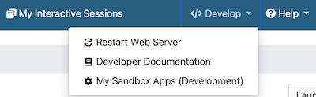
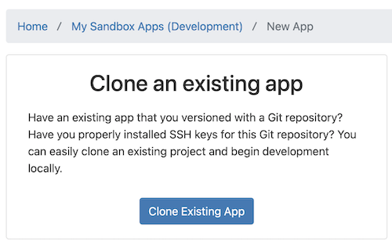
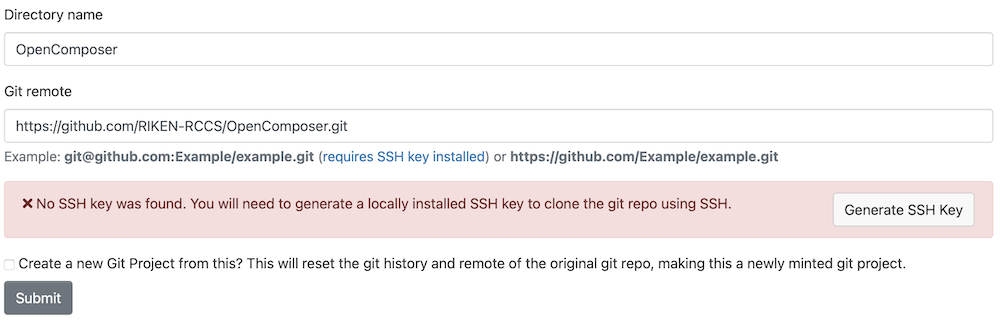
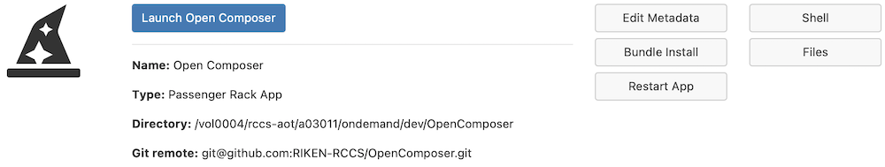

## Open Composerのインストール方法
Open Composerは[Open OnDemand](https://openondemand.org/)上で動作します。Open ComposerをOpen OnDemandのアプリケーションディレクトリ`/var/www/ood/apps/sys/`に保存してください。

```
# cd /var/www/ood/apps/sys/
# git clone https://github.com/RIKEN-RCCS/OpenComposer.git
```

## Open Composerの設定
`./OpenComposer/conf.yml.erb`を編集してください。`scheduler`と`apps_dir`以外は省略可能です。ただし、`scheduler`で`sge`を選択した場合は、`sge_root`の設定が必要です。

| 項目名 | 設定内容 |
| ---- | ---- |
| scheduler | 利用するスケジューラ（`slurm`、`pbspro`、`sge`、`fujitsu_tcs`） |
| apps_dir | アプリケーションのディレクトリ |
| login_node | Open OnDemandのWebターミナルを起動した際のログイン先 |
| data_dir | 投入したジョブの情報のディレクトリ |
| bin | ジョブスケジューラのコマンドのパス |
| bin_overrides | ジョブスケジューラの各コマンドのパス |
| ssh_wrapper | SSHを用いて他のノードのジョブスケジューラを用いる場合のコマンド |
| sge_root | Grid Engineのルート用ディレクトリ（SGE_ROOT） |
| footer | フッタに記載する文字 |
| thumbnail_width | トップページの各アプリケーションのサムネイルの横幅 |
| navbar_color | ナビゲーションバーの色 |
| dropdown_color | ドロップダウンメニューの色 |
| footer_color | フッタの色 |
| category_color | トップページのカテゴリの背景色 |
| description_color | アプリケーションページのアプリケーション説明の背景色 |
| form_color | アプリケーションページのテキストエリアの背景色 |

### bin_overridesの設定（オプション）
ジョブスケジューラが`slurm`の場合は、`sbatch`、`scontrol`、`scancel`、`sacct`を設定します。

```
bin_overrides:
  sbatch:   "/usr/local/bin/sbatch"
  scontrol: "/usr/local/bin/scontrol"
  scancel:  "/usr/local/bin/scancel"
  sacct:    "/usr/local/bin/sacct"
```

ジョブスケジューラが`pbspro`の場合は、`qsub`、`qstat`、`qdel`を設定します。

```
bin_overrides:
  qsub:   "/usr/local/bin/qsub"
  qstat: "/usr/local/bin/qstat"
  qdel:  "/usr/local/bin/qdel"
```

ジョブスケジューラが`sge`の場合は、`qsub`、`qstat`、`qdel`、`qacct`を設定します。

```
bin_overrides:
  qsub:   "/usr/local/bin/qsub"
  qstat: "/usr/local/bin/qstat"
  qdel:  "/usr/local/bin/qdel"
  qacct: "/usr/local/bin/qacct"
```

ジョブスケジューラが`fujitsu_tcs`の場合は、`pjsub`、`pjstat`、`pjdel`を設定します。

```
bin_overrides:
  pjsub:  "/usr/local/bin/pjsub"
  pjstat: "/usr/local/bin/pjstat"
  pjdel:  "/usr/local/bin/pjdel"
```

## 管理者によるOpen OnDemandへの登録
Open Composerを`/var/www/ood/apps/sys/`に保存すると、Open OnDemandのトップページにOpen Composerのアイコンが表示されます。Open Composerのアイコンが表示されない場合は、Open OnDemand用の設定ファイル`./OpenComposer/manifest.yml`を確認してください。

Open Composer上のアプリケーションをOpen OnDemandのトップページに表示することもできます。例えば、`./OpenComposer/apps/Slurm/`というアプリケーションを表示させたい場合は、同名のディレクトリをOpen OnDemandのアプリケーションディレクトリに作成します（`# mkdir /var/www/ood/apps/sys/Slurm`）。そして、そのディレクトリ内に下記のようなOpen OnDemand用の設定ファイル`manifest.yml`を作成します。

```
# cat /var/www/ood/apps/sys/Slurm/manifest.yml
---
name: Slurm
url: https://example.net/pun/sys/OpenComposer/Slurm
```

## 一般ユーザによるOpen OnDemandへの登録
一般ユーザ権限でOpen Composerをインストールすることもできます。ただし、事前に管理者権限でOpen OnDemandの[App Development](https://osc.github.io/ood-documentation/latest/how-tos/app-development/enabling-development-mode.html)の機能を有効化する必要があります。

ナビゲーションバーの「</> Develop」の「My Sandbox Apps (Development)」を選択します（Webブラウザのウィンドウサイズが小さい場合は、「</> Develop」ではなく「</>」と表示されますので注意ください）。



「New App」をクリックします。


「Clone Existing App」をクリックします。



「Directory name」に任意の名前（ここではOpenComposer）、「Git remote」に「[https://github.com/RIKEN-RCCS/OpenComposer.git](https://github.com/RIKEN-RCCS/OpenComposer.git)」を記入し、「Submit」をクリックします。



「Launch Open Composer」をクリックします。



Open OnDemand用の設定ファイルである`./OpenComposer/manifest.yml`を編集すると、Open OnDemandのトップページにOpen Composerのアイコンが表示されます（このアイコンはインストールしたユーザでしか表示されません）。