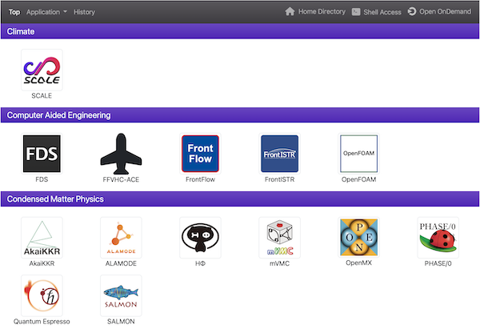
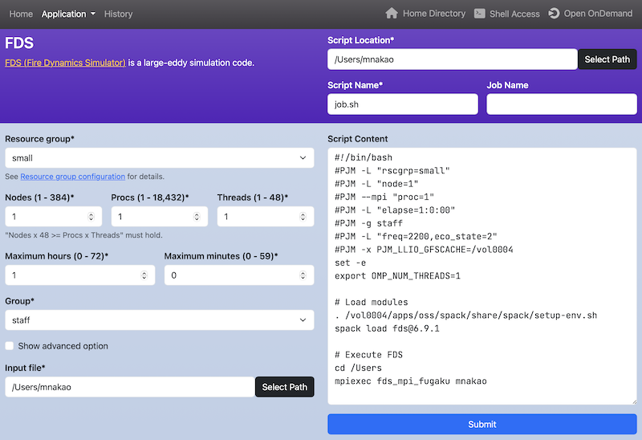
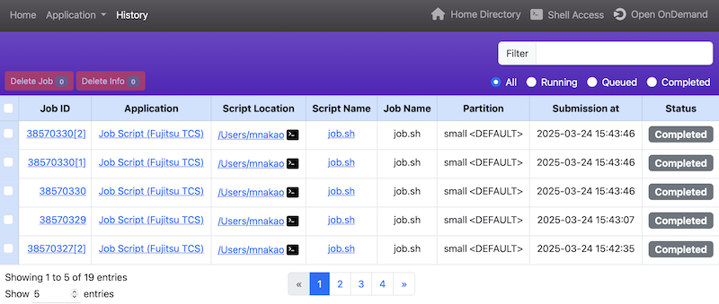

## はじめに
Open ComposerはWebブラウザからジョブスケジューラにバッチジョブを投入することができるWebアプリケーションです。

## Webページの説明
### トップページ
アプリケーションのアイコンがカテゴリ毎に表示されます。
ナビゲーションバーの左側には、それぞれ「トップページ」、「アプリケーションページ」、「履歴ページ」へのリンクがあります。
ナビゲーションバーの右側には、それぞれOpen OnDemandの「Home Directory」、「Shell Access」、「ダッシュボード」へのリンクがあります。
ただし、「Shell Access」は`conf.yml.erb`で`login_node`が設定されている場合のみ表示されます。

### アプリケーションページ
ジョブスクリプトを生成します。ページ左のWebフォームに値を入力すると、ページ右のテキストエリアにジョブスクリプトが動的に生成されます。テキストエリアは自由に編集できます。テキストエリアの下の「Submit」ボタンをクリックすると、生成されたジョブスクリプトがジョブスケジューラに投入されます。

### 履歴ページ
これまでのジョブ履歴を閲覧できます。ジョブの実行状況の確認や実行中のジョブの停止も可能です。

- ヘッダ右の「Filter」に文字を入力してエンターキーを押すと、その文字と「Script Name」もしくは「Job Name」とが一致しているジョブのみが表示されます。
- ヘッダ右の「All」、「Running」、「Queued」、「Completed」のラジオボタンをクリックすると、それぞれの状態に対応したジョブのみが表示されます。
- 実行中のジョブやキューに登録されているジョブをキャンセルしたい場合は、そのジョブの一番左のチェックボックスをチェックし、表の上にある「Delete Job」をクリックします。
- 完了したジョブの情報を表から削除したい場合は、そのジョブの一番左のチェックボックスをチェックし、表の上にある「Delete Info」をクリックします。
- 「Job ID」のリンクをクリックすると、ジョブの詳細が表示されます。
- 「Application」のリンクをクリックすると、そのアプリケーションのページが開きます。また、その横にアイコンがある場合、そのアイコンをクリックすると該当のOpen OnDemandのアプリケーションページが開きます。
- 「Script Location」のリンクをクリックすると、Open OnDemandのHome Directoryのアプリケーションが起動します。また、ターミナルのアイコンがある場合、そのアイコンをクリックするとOpen OnDemandのTerminalアプリケーションが起動します。
- 「Script Name」のリンクをクリックすると、そのスクリプトで用いられたパラメータがロードされた状態でアプリケーションのページが開きます。